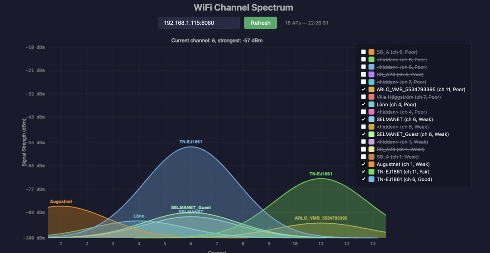

# WiFi Scanner — ESP32-S3 + AtomVM

A WiFi network scanner for ESP32-S3 running on [AtomVM](https://github.com/atomvm/AtomVM).
Periodically scans for nearby access points, caches results with TTL-based
eviction, prints to serial console, and serves them as JSON over HTTP.

## Project Structure

```
src/
  wifi_scanner.erl                  - AtomVM entrypoint, network, HTTP server, scanner loop
  wifi_scanner_cache.erl            - AP cache with TTL eviction, JSON export, console display
  wifi_scanner_config.erl.template  - Config template (copy and fill in credentials)
  wifi_scanner.app.src              - Application resource file
```

## Prerequisites

Install the `esptool.py` like this:

```bash
python3 -m venv .venv
source .venv/bin/activate
pip install -r requirements.txt
```

## Configuration

Copy the template and fill in your WiFi credentials:

```bash
cp src/wifi_scanner_config.erl.template src/wifi_scanner_config.erl
```

Then edit `src/wifi_scanner_config.erl`:

```erlang
get_config() ->
    [
        {sta, [{ssid, <<"YOUR_SSID">>}, {psk, <<"YOUR_PASSWORD">>}]},
        {scan_interval, 5000},   %% ms between scans
        {http_port, 8080}
    ].
```

The config file is gitignored to keep credentials out of version control.

## Build

```bash
rebar3 atomvm packbeam
```

## Flash

```bash
esptool.py --chip auto --port /dev/cu.usbmodem5B414826621 --baud 115200 \
           --before default_reset --after hard_reset write_flash -u \
           --flash_mode keep --flash_freq keep --flash_size detect 0x250000 \
           _build/default/lib/wifi_scanner.avm
```

## Monitor (minicom)

```bash
minicom -D /dev/cu.usbmodem5B414826621 -b 115200
```

Example console output:

```
========== WiFi Scan Results (12) ==========
SSID                             CH   RSSI   Auth       Quality    TTL
---------------------------------------------------------------------------
MyNetwork                        6    -42    WPA2       Excellent  5/5
Neighbor                         11   -71    WPA/WPA2   Good       4/5
FreeWifi                         1    -83    OPEN       Fair       5/5
========================================
```

## HTTP API

Once connected to WiFi, the ESP32 serves scan results as JSON:

```bash
curl http://<ESP32_IP>:8080/
```

Example response:

```json
{
  "count": 3,
  "networks": [
    {"ssid": "MyNetwork", "channel": 6, "rssi": -42, "authmode": "wpa2_psk", "quality": "Excellent", "ttl": 5},
    {"ssid": "Neighbor", "channel": 11, "rssi": -71, "authmode": "wpa_wpa2_psk", "quality": "Good", "ttl": 4},
    {"ssid": "FreeWifi", "channel": 1, "rssi": -83, "authmode": "open", "quality": "Fair", "ttl": 5}
  ]
}
```

## Visualization

A standalone HTML/JS page (`viz/index.html`) fetches scan results and draws
APs as bell curves on a channel spectrum chart.

<a href="wifi-scanner.jpg"></a>

Serve locally and open in a browser:

```bash
cd viz && python3 -m http.server 3000
# open http://localhost:3000
```

## Roadmap

- [x] Step 1: WiFi scanning with serial console output
- [x] Step 2: HTTP API for remote polling
- [x] Step 3: Add visualization
- [ ] Step 4: Display obtained IP address in TFT display
