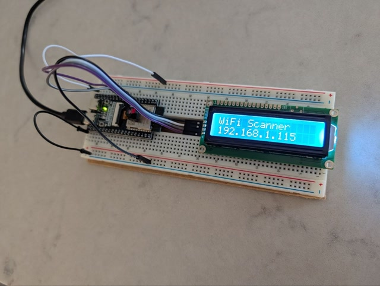

# WiFi Scanner — ESP32-S3/Pico-W + AtomVM

A WiFi network scanner for ESP32-S3 or PI Pico-W running on [AtomVM](https://github.com/atomvm/AtomVM).
Periodically scans for nearby access points, caches results with TTL-based
eviction, prints to serial console, and serves them as JSON over HTTP.
Determines device location via Apple's WiFi Positioning System (WPS) using
visible BSSIDs.

An optional LCD display may be used to display the obtained IP address.

## Prerequisites

### ESP32-S3

Install `esptool.py`:

```bash
python3 -m venv .venv
source .venv/bin/activate
pip install -r requirements.txt
```

### Pico W

Install [picotool](https://github.com/raspberrypi/picotool) (v2.x):

```bash
brew install picotool   # macOS
```

## Configuration

Copy the template and fill in your WiFi credentials:

```bash
cp src/wifi_scanner_config.erl.template src/wifi_scanner_config.erl
```

Then edit `src/wifi_scanner_config.erl`:

```erlang
get_config() ->
    [
        {sta, [{ssid, <<"YOUR_SSID">>}, {psk, <<"YOUR_PASSWORD">>}]},
        {scan_interval, 5000},   %% ms between scans
        {http_port, 8080},
        %% Optional: override default I2C pins for LCD
        %% {i2c_sda, 4},
        %% {i2c_scl, 5}
    ].
```

| Setting        | Default (ESP32) | Default (Pico W) | Description                  |
|----------------|-----------------|------------------|------------------------------|
| `scan_interval`| 5000            | 5000             | ms between WiFi scans        |
| `http_port`    | 8080            | 8080             | HTTP API listen port         |
| `i2c_sda`      | 8               | 4                | GPIO pin for I2C SDA (LCD)   |
| `i2c_scl`      | 9               | 5                | GPIO pin for I2C SCL (LCD)   |

The config file is gitignored to keep credentials out of version control.

## Build

```bash
rebar3 atomvm packbeam
```

For the Pico W, also create a UF2 image:

```bash
rebar3 atomvm uf2create
```

## Flash

### ESP32-S3

```bash
# Example (your port may differ)
esptool.py --chip auto --port /dev/cu.usbmodem5B414826621 --baud 115200 \
           --before default_reset --after hard_reset write_flash -u \
           --flash_mode keep --flash_freq keep --flash_size detect 0x250000 \
           _build/default/lib/wifi_scanner.avm
```

### Pico W

The Pico W flash is split into three regions. The AtomVM firmware and core
libs only need to be flashed once (or when AtomVM is rebuilt):

```bash
# 1. AtomVM firmware (one-time)
picotool load -f /path/to/AtomVM/src/platforms/rp2/build/src/AtomVM.uf2

# 2. Core libs (one-time)
picotool load -f /path/to/AtomVM/src/platforms/rp2/build/tests/test_erl_sources/HostAtomVM-prefix/src/HostAtomVM-build/libs/atomvmlib-rp2-pico.uf2

# 3. Application (after each rebuild)
picotool load -f _build/default/lib/wifi_scanner.uf2
```

## Monitor

### ESP32-S3 (minicom)

```bash
# Example (your port may differ)
minicom -D /dev/cu.usbmodem5B414826621 -b 115200
```

### Pico W (serial over USB)

```bash
# Find the device
ls /dev/cu.usbmodem*

# Read output (or use minicom)
minicom -D /dev/cu.usbmodem11101 -b 115200
```

Example console output (note the obtained IP address):

```
...
wifi_scanner: got IP: 192.168.1.115
wifi_scanner: waiting for connection...
wifi_scanner: HTTP listening on port 8080
wifi_scanner: try: curl http://192.168.1.115:8080/
wifi_scanner: initializing LCD1602 (SDA=8, SCL=9)
I (5747) i2c_driver: I2C driver installed using I2C port 0
wifi_scanner: LCD showing IP: 192.168.1.115
wifi_scanner: scanner started, interval=5000 ms
...
========== WiFi Scan Results (12) ==========
SSID                             CH   RSSI   Auth       Quality    TTL
---------------------------------------------------------------------------
MyNetwork                        6    -42    WPA2       Excellent  5/5
Neighbor                         11   -71    WPA/WPA2   Good       4/5
FreeWifi                         1    -83    OPEN       Fair       5/5
========================================
```

## HTTP API

Once connected to WiFi, the ESP32 serves scan results as JSON:

```bash
curl http://<ESP32_IP>:8080/
```

Example response:

```json
{
  "count": 3,
  "networks": [
    {"ssid": "MyNetwork", "channel": 6, "rssi": -42, "authmode": "wpa2_psk", "quality": "Excellent", "ttl": 5},
    {"ssid": "Neighbor", "channel": 11, "rssi": -71, "authmode": "wpa_wpa2_psk", "quality": "Good", "ttl": 4},
    {"ssid": "FreeWifi", "channel": 1, "rssi": -83, "authmode": "open", "quality": "Fair", "ttl": 5}
  ],
  "location": {"lat": 59.328228, "lng": 18.055349, "accuracy": 21}
}
```

The `location` field is included once geolocation has been determined (requires
at least 3 visible APs). It is omitted if geolocation has not yet completed.

## Visualization

A standalone HTML/JS page (`viz/index.html`) fetches scan results and draws
APs as bell curves on a channel spectrum chart. Below the chart, a map shows
the device's estimated location (determined via Apple's WiFi Positioning System).

<a href="wifi-scanner.jpg"></a>

Goto: [https://etnt.github.io/wifi_scanner/](https://etnt.github.io/wifi_scanner/)

or serve locally and open in a browser:

```bash
cd viz && python3 -m http.server 3000
# open http://localhost:3000
```

## LCD Display

A Freenove LCD1602 display (HD44780 with PCF8574 I2C backpack) shows the
obtained IP address after connecting to WiFi.

### Wiring

| LCD Module | ESP32-S3 | Pico W   |
|------------|----------|----------|
| GND        | GND      | GND      |
| VCC        | 5V       | VBUS (5V)|
| SDA        | GPIO 8   | GPIO 4   |
| SCL        | GPIO 9   | GPIO 5   |

These are the default pins. Override with `{i2c_sda, N}` and `{i2c_scl, N}`
in `wifi_scanner_config.erl` if your wiring differs.

The PCF8574 backpack is at I2C address `0x27`. The contrast can be adjusted
with the blue potentiometer on the back of the module.

<a href="wifi-scanner-display.jpg"></a>

## Geolocation

The device determines its location by querying Apple's WiFi Positioning System
(WPS) with the BSSIDs of visible access points. This is done over HTTPS to
`gs-loc.apple.com` using a protobuf-encoded request.

- Requires at least 3 visible APs
- Re-queries only when >50% of visible BSSIDs change (i.e. the device has moved)
- Location (lat/lng/accuracy) is included in the HTTP API response and shown on
  the map in the visualization page
- **Not available on Pico W** — the RP2 platform lacks TLS support, so
  geolocation is automatically skipped

The implementation uses:
- `apple_wps.erl` — protobuf encode/decode + Apple WPS protocol
- `https_client.erl` — minimal HTTPS POST client (TLS via AtomVM's ssl module)
- `aprotobuf` — lightweight protobuf library for AtomVM

## Roadmap

- [x] Step 1: WiFi scanning with serial console output
- [x] Step 2: HTTP API for remote polling
- [x] Step 3: Add visualization
- [x] Step 4: Display obtained IP address on LCD1602 via I2C
- [x] Step 5: Geolocation via Apple WPS (WiFi Positioning System)


